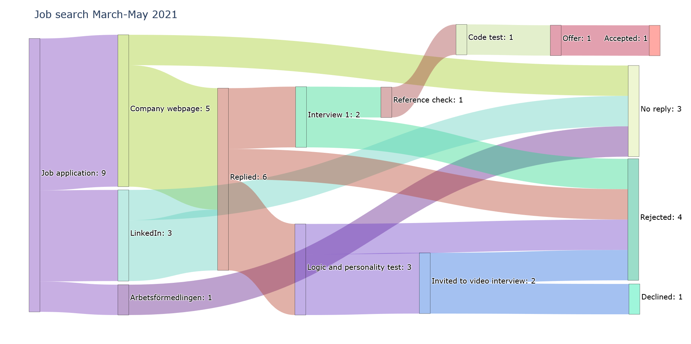

# Sankey-diagram-for-job-search 📈👔🍎
> A basic python program to use to visualize a job search progress. 

## Why this?
Started working on this to get motivation for job search really. Very inagile at the moment but may get there. 

## Example diagram

To-do list:
* Make .csv-file input an option

## Status
Project is: very much _in progress_

## Inspiration
By my friend Simon.
